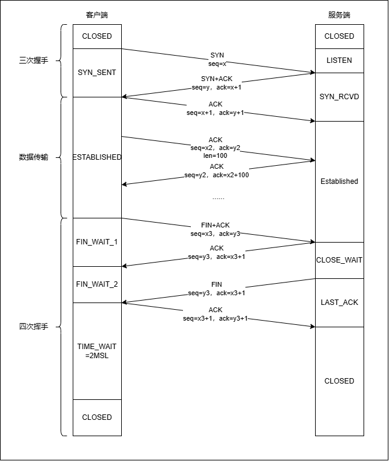

# 整体概览


# 定义
- sequence number: 表示我方.(对于没有数据的传输,如ACK,虽然也有一个seq,但是这次传输在整个data stream中不占位置,所以下一个实际有数据的传输,依然会从上一个发送ACK的数据包的seq开始)
- acknowledgment number: 表示期望对方的下一次sequence number是多少
- 注:虽然SYN/ACK传输也没有data,但仍然会让下一次seq+1;ACK则不会

SYN标志消耗一个序号,即+1.SYN报文数据长度为1        
ACK标志不消耗,发送无需任何代价,是TCP首部的一部分(一旦建立连接,则总是被置为1).只有ACK标志为1时,ack确认序号(acknowledgment Number)才生效      

# 控制位
## URG: Urgent,紧急
当URG=1时,它告诉系统此报文中有紧急数据,应当优先传送(比如紧急关闭),这要与紧急指针字段配合使用
## ACK: Acknoeledgment,确认
仅当ACK=1时确认号字段acknowledgment number才有效.建立连接后均置为1
## PSH: Push,推送
若TCP连接的一端希望另一端立即响应,PSH字段便可以催促对方,不再等待缓存区填满才发送
## RST: Reset,复位
若TCP连接出现严重错误,RST置为1,断开TCP连接,再重新建立连接
## SYN: Syn,同步
用于建立和释放连接
## FIN: Fin,结束
用于释放连接,当FIN=1,表明发送方已经发送完毕,要求释放TCP连接

# 三次握手
|序号|方向|seq|ack|SYN|ACK|
|:---:|:---:|:---:|:---:|:---:|:---:|
|1|A->B|x|0|1|0|
|2|B->A|y|x+1|1|1|
|3|A->B|x+1|y+1|0|1|

# 数据传输(A传输给B,B发送ack)
|序号|方向|seq|ack|数据长度|
|:---:|:---:|:---:|:---:|:---:|
|22|A->B|m|n|len|
|23|B->A|n|m+len|0|
|24|A->B|m+len|n|n|len2|
|25|B->A|n|m+len+len2|0|

B发送确认ack,没有实际数据,seq不增长

# 四次挥手
|序号|方向|seq|ack|FIN|ACK|
|:----:|:----:|:----:|:----:|:----:|:----:|
|1|A->B|x|y|1|1|
|2|B->A|y|x+1|0|1|
|3|B->A|y|x+1|1|1|
|4|A->B|x+1|y+1|0|1|

# 握手一定得要三次吗
不一定,第三次握手是可以携带数据的

# 三次握手异常
## TCP第一次握手的SYN丢包
一直没有收到服务端的ACK, 超时重传(eg:5),每次RTO超时时间呈指数上涨(翻倍)
- 第一次重传 1s后
- 第二次重传 3s后
- 第三次重传 7s后
- 第四次重传 15s后
- 第五次重传 31s后

超时重传次数: ```/proc/sys/net/ipv4/tcp_syn_retries```参数设定,默认为5  

## TCP第二次握手的SYN,ACK丢包
客户端会超时重传SYN包,服务端也会超时重传SYN+ACK包       
第二次握手AYN+ACK包的最大重传次数```/proc/sys/net/ipv4/tcp_synack_retries```参数设定,默认为5

## 第三次握手的ACK丢包
此时客户端处于ESTABLISHED状态,但服务端处于SYN_RECV状态,没进入      
服务端超时重传SYN+ACK,超过```tcp_synack_retries```的值后,不再继续重传,此时服务端的TCP连接主动中止了.但客户端仍然连接状态,后续发送数据时,超时重传次数由```/proc/sys/net/ipv4/tcp_retries2```的值决定,默认值为15      
- 服务端没发送数据包,一直处于ESTABLISHED状态,等待2h12m15s后发现死亡连接,客户端断开连接
- 客户端发送数据包,重传数据包```tcp_retries2```即默认15次后,客户端断开连接

# TCP保活机制
定义一个时间段,在这个时间段内,如果没有任何连接相关的活动,TCP保活机制就会开始作用        
每隔一个时间间隔,发送一个探测报文(很小),如果连续几个探测报文都没有得到回应,则认为当前的TCP连接已死亡,系统内核将错误信息通知上层应用程序     
- ```net.ipv4.tcp_keepalive_time=7200```保活时间为7200秒
- ```net.ipv4.tcp_keepalive_tntvl=75```每次检测间隔75秒
- ```net.ipv4.tcp_keepalive_probes=9```表示9次无响应,则表示对方不可达,从而中断本次连接

由上可算出,最少需要经过2h12m15s才能发现一个死亡连接     

# TCP 快速建立连接
以客户端向服务端发起HTTP GET请求为例        
- 一个完整的交互,需要2.5RTT
- 第三次握手携带HTTP GET请求数据,则需要2RTT

## TCP Fast Open
- 第一次建立连接时相同,只是第二次握手时会产生一个Cookie(已加密),并通过SYN+ACK包一同发给客户端,客户端缓存.第一次发起HTTP GET时仍需要2RTT
- 第二次发起请求时,客户端在SYN包上带上Cookie发给服务端,就可以提前跳过三次握手的过程,客户端能从Cookie中获取TCP相关信息.此时只需要1RTT(没有前两次)

# TCP重复确认+快速重传
当接收方收到乱序的数据包时,会发送重复的ACK,以便告知发送方要重发该数据包,当发送方收到三个重复的ACK时,就会触发快速重传,立即重发丢失的数据包,并不用等待超时重传

开启SACK后,只需要重传丢失的数据包,而不用重传丢失之后的每个数据包


# TCP流量控制(滑动窗口)
TCP为了防止发送方无脑地发送数据,导致接收方缓冲区被填满,所有就有了滑动窗口的机制,可以利用接收方的接收窗口来控制发送方要发送的数据量,即流量控制       

接收窗口是由接收方指定的值,存储在TCP头部中,可以告诉发送方自己的TCP缓冲区间大小,用以读取数据     

接收方可能会繁忙,程序不能及时读取缓冲区数据,缓冲区空间会被逐渐占满.为了保证发送方发送的数据不会超过缓冲区大小,服务器会调整窗口大小的值,接着通过ACK报文通知给对方,告知现在的接收窗口大小,从而控制发送方发送的数据大小        

# 零窗口通知与窗口探测
接收方缓存区满时,接收窗口为0,此时发送零窗口通知给发送方     
当发送方接收到零窗口通知时,就会停止发送数据     
发送方会定时发送窗口大小探测报文(TCP Keep-Alive报文),以便及时直到接收方窗口大小的变化
仍然为零窗口,则翻倍等待继续发送窗口探测报文            

# TCP拥塞控制


# 发送窗口
发送窗口 = min(拥塞窗口, 接收窗口)          
发送窗口决定一口气能发送多少字节        
MSS决定这些字节要分多少包才能发完       


